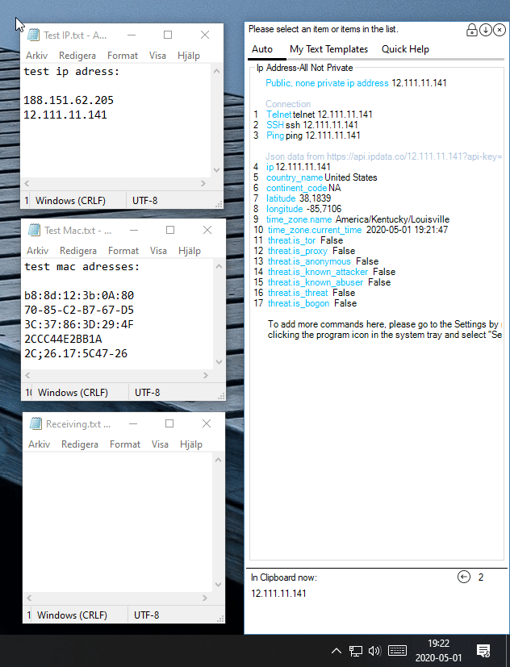

# ClipboardHelperRegEx
## Why use Clipboard Helper RegEx
- When repetative copying and pasting is needed between different programs in Windows.
- When there is a need of automated manipulation of the copied text to the Clipboard. 
- Instead of having template texts on Notepad or another text editor, this program can have them easily selectable and easy to paste.

## How the program works

- Can monitor Windows Clipboard for changes.
- If there is a new text in the Clipboard, the program tries to match the Clipboard text with a list of predefined (Reg)ular (Ex)pressions.
- If any of the defined RegEx can match the new text in the Clipboard, a list of predefined selectable texts is shown. 
- When line(s) of text in the list is/are selected, it's copied to the Clipboard where it can be pasted to other programs.
- Every list has a specific Regular Expression that determines when that specific list is shown.
- If the program can't match any RegEx with a new text in Clipboard, then nothing happens.

# Features
## Console Pasting
- Paste commands to ANY other program. Also paste to any other Console Program such as Putty, MobaXterm, mRemoteNG with an alternative pasting method.

## None Intrusive
- Show program automatically only when needed. Place the windows anywhere, resize it, minimize, close or resize program internally.

## Template texts
- Store and organize template texts, easily reachable and easily selectable.

## Shortcut-keys
- Show window with Shortcut-keys. Keys can be changed in the settings.

## History navigation
- Navigate back and forward in History to find old copied texts.

## Open Web Browser automatically
- Open your default Web Browser automatically and open Web Pages automatically.

## Open PowerShell and execute commands
- Open PowerShell console automatically and execute commands.

## Retrieve Json data
- Automatically retrieve and show Json data.

## Import CSV files
- Import CSV formatted files and retrieve its data.

## Auto start
- Start automatically upon Windows boot.

## Automatic updates 
- Automatic checking of updates with ClickOnce and automated installation.

## Lightweight
- Programmed in C#. Lightweight with very low CPU usage.

## License
GNU GENERAL PUBLIC LICENSE Version 3

## Requirements
- Windows 10.
- Microsoft Net framework 4.8. (Should be downloaded automatically upon installation if needed)
- Older Windows hasn't been tested, no support.

## Features
- Can select multiple lines of texts with Mouse, CTRL and SHIFT (as selecting files in Explorer). This can be ideal when pasting multiple commands to console windows with CTRL+V. 
- Shows which text is in Clipboard now.
- Automatically start upon Windows boot.
- Deactivate program. When deactivated it won't listen Clipboard for changes.
- Main window can be automatically closed, minimized or remain visible after a text has been selected.
- Set the number of seconds the main window remain visible after selecting a text in the list.
- Main window can be closed instantly or slowly faded.
- Main window can be set to be focused when shown.
- Main window can be shown in three ways: Program matches Clipboard with RegEx, by selecting "Show" in the icon menu or with predefined short cut keys.
- Set a combination of shortcut keys (CTRL, ALT, SHIFT, WIN and A to Z) to show the main program window when pressed.
- Change the default line selection color and some other color settings.
- Can hold one secret and secure password which can be used when selecting texts and pasting. This is helpful when logging in to places. The stored password is securely stored in Windows Credential Manager.
- Prompt for username and password when requesting Json data which is password protected. This login information can be securely stored in Windows Credential Manager.
- Alternative pasting method. Ability to paste in console programs which usually doesn't support pasting with CTRL+V. This set of programs can be changed in the settings. The pre stored programs are: MobaXterm; mRemoteNG; PuTTY; ConEmu64.
- Can be resetted to factory settings in the settings.
- Has two different Tabs, "Auto" and "Manual". The Auto tab can't be renamed. The Manual tab can be renamed in the settings.
- Auto tab can be shown by selecting it with the mouse, keyboard left arrow navigation key or when there is a RegEx match with the Clipboard.
- Auto tab has navigation buttons so it's possible to go backwards in copy history. 
- Manual tab can be shown by selecting it with the mouse or with the keyboard arrow navigation keys when main window is in focus.
- All the saved Auto- and Manual tabs are saved in two settings files: AutoShownTabs.xml and ManuallyShownTabs.xml.
- Ability to quickly replace the programs default AutoShownTabs.xml and ManuallyShownTabs.xml files with new files (in Advanced Settings).
- Advanced ability to control if the replaced the AutoShownTabs.xml or ManuallyShownTabs.xml are valid. 
- Ability to import csv files which data can be shown when program matches with clipboard (in Advanced Settings).
- All lines are numbered.
- All lines can be selected using the keyboard with keys 0-9.
- A line selection can always be aborted by clicking the Escape key. 
- When program system tray icon is left mouse clicked, all formatting is removed from the text currently in Clipboard.

## How to use
- The program comes with some default settings. The program can show these pre-defined Auto tabs:
  - "Ip Address-All Not Private"
  - "Ip Address-Class A Private"
  - "Ip Address-Class B Private"
  - "Ip Address-Class C Private"
  - "Mac Address"
  - "Switch"

- To test Auto tabs, please copy the following text with CTRL+C or right click with the mouse and select copy.
  - copy after arrow -> 10.33.23.42 port1/0/15
  - copy after arrow -> 17.31.0.213 port0/0/5
  - copy after arrow -> 17.31.0.213
  - copy after arrow -> 171.31.0.213
  - copy after arrow -> 35.31.0.213
  - copy after arrow -> 53.31.0.213
  - copy after arrow -> 53.31.1.256		(not a valid IP address, nothing happens)
  - copy after arrow -> 10.2.0.1
  - copy after arrow -> 172.16.0.0
  - copy after arrow -> 192.168.0.0
  - copy after arrow -> b8:8d:12:3b0A80
  - copy after arrow -> 00000ABB28FC
  - copy after arrow -> 70-85-C2-B7-67-D5
  - copy after arrow -> G0-85-C2-B7-67-D5 	(not a valid MAC address, nothing happens)

## Installation
- Download the latest [Setup](https://github.com/PeterAfN/ClickOnceForClipboardRegexPaster/blob/master/publish/setup.exe?raw=true).
- Open (execute) the file and start installation of the program.
- If shown: Bypass Windows SmartScreen by clicking "More Info" and click "Run anyway".
- Click install when the new Security warning dialog appears.
- Done!

## Developer
- Peter Palosaari

## Project status
- No new features are been developed at this point.
- Bugs are fixed.